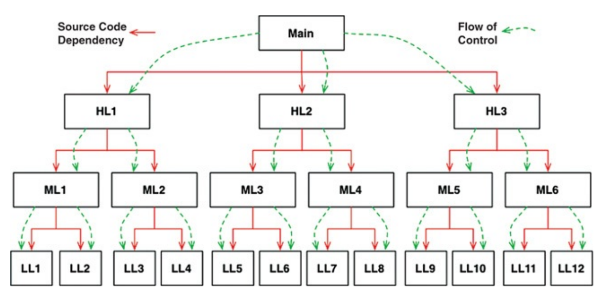
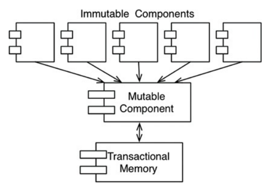
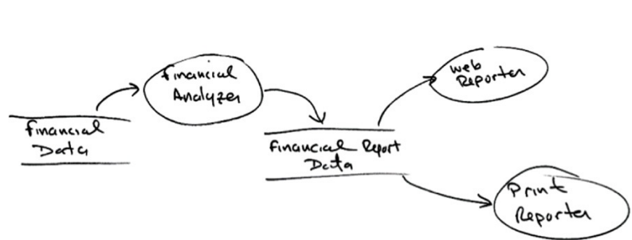
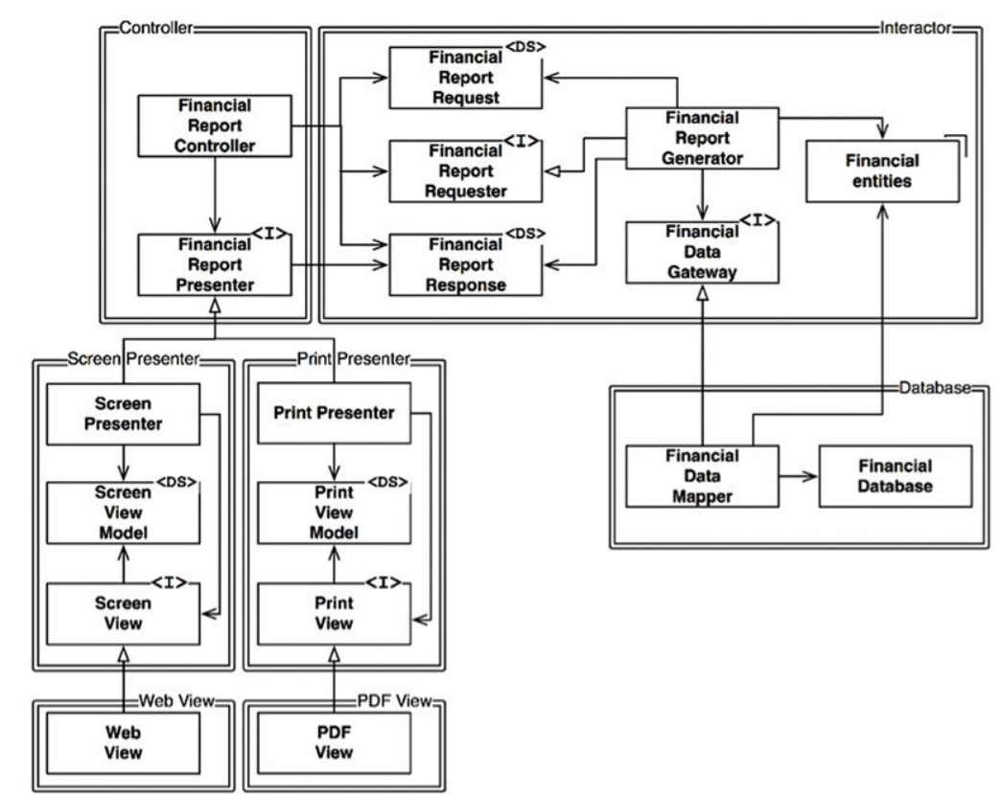

# Book-Clean-Architecture
This is a learning repo based on the book "Clean Architecture: A Craftsman's Guide to Software Structure and Design 1st edition" by Robert C. Martin, practiced with C#

# Part I
## Chapter 1: What is design and architecture
Hai khái niệm **design** và **architecture** không có gì khác biệt 

### The Goal?
```
The goal of software architecture is to minimize the human resources required to build and
maintain the required system.
```

### Case Study
```
writing messy code makes developers go fast in the short term, and just slows them down in the long term
```

## Chapter 2: A Tale of two values
- Every software system provides two different values to the stakeholders: **behavior and structure**

### Behaviour
- Giá trị đầu tiên của phần mềm nằm ở việc nó phải hành động (behave) giống theo requirements

### Architecture
- Phần mềm có cấu trúc **tốt** cho phép developer mở rộng/thay đổi tính năng dễ dàng hơn
### The Greater Value
If you ask the business managers, they’ll often say that it’s more important for the software system to work. Developers, in turn, often go along with this attitude. But it’s the wrong attitude. I can prove that it is wrong with the simple logical tool of examining the extremes.
```
If you give me a program that works perfectly but is impossible to change, then it won’t work when the requirements change, and I won’t be able to make it work. Therefore the program will become useless. 

If you give me a program that does not work but is easy to change, then I can make it work, and keep it working as requirements change. Therefore the program will remain continually useful.
```

### EISENHOWER’S MATRIX

| Important and urgent   | Important and not urgent   |
|------------------------|----------------------------|
| Unimportant and urgent | Unimportant and not urgent |  

The value **behavior** is urgent but not always particularly important.  
The value **architecture** is important but never particularly urgent.

Ta có thể đưa ra thang ưu tiên như sau:
1. Important and urgent
2. Important and not urgent
3. Unimportant and urgent
4. Unimportant and not urgent

**Architecture** nằm ở vị trí 1 và 2, trong đó **Behaviour** nằm ở vị trí 1 và 3. Người Business Manager và developers thường mắc lỗi sai ở chỗ không phân biệt được **behaviour** nào ở vị trí 1, **behaviour** nào ở vị trí 3

```
The dilemma for software developers is that business managers are not equipped to evaluate the importance of architecture. That’s what software developers were hired to do. Therefore it is the responsibility of the software development team to assert the importance of architecture over the urgency of features.
```

### Fight for the architecture
Development team cần phải đảm bảo phần mềm có 1 **architecture** tốt, thay vì để bản thân bị ép phải tập trung vào phát triển các **behaviour** của sản phẩm

# Part II: Starting with the bricks: Programming Paradigms
## Chapter 3: Paradigm Overview
### Structured Programming 
```
Structured programming imposes discipline on direct transfer of control.
```

### Object-oriented Programming
Ole Johan Dahl and Kristen Nygaard. These two programmers noticed that the function call stack frame in the ALGOL language could be moved to a heap, thereby allowing local variables declared by a function to exist long after the function returned. The function became a constructor for a class, the local variables became instance variables, and the nested functions became methods. This led inevitably to the discovery of polymorphism through the disciplined use of function pointers.
```
Object-oriented programming imposes discipline on indirect transfer of control.
```

### Functional Programming
Alonzo Church, who
in 1936 invented l-calculus while pursuing the same mathematical problem that was motivating Alan Turing at the same time. His l-calculus is the foundation of the LISP language, invented in 1958 by John McCarthy. A foundational notion of l-calculus is immutability—that is, the notion that the values of symbols do not change. This effectively means that a functional language has no assignment statement. Most functional languages do, in fact, have some means to alter the value of a variable, but only under very strict discipline.
```
Functional programming imposes discipline upon assignment.
```

### Food for thought
Mỗi paradigm ở trên thực chất, sẽ **ngăn** programmer không được làm 1 việc gì đó. Các paradigm cho chúng ta biết **không được làm việc gì** hơn là **được làm gì**. Mỗi paradigm ở trên sẽ lần lượt ngăn chúng ta sử dụng: **goto** statement, fucntion pointers, assignment

### Conclusion
- Mỗi paradigm này có mối quan hệ thế nào với architecture
- Mọi thứ:
  - Ta dùng polymorphism như cơ chế để vượt qua ranh giới kiến trúc (architectural boundaries)
  - Ta dùng functional programming để áp đặt kỷ luật (discipline) vào việc lưu trữ và truy cập data
  - Ta dùng structured programming như nền tảng thuật toán của các module 

- Những điều ở trên phù hợp với 3 mối quan tâm lớn của **architecture**: function, separation of components, và data management. 

## Chapter 4: Structured Programming 
### Proof
The problem that Dijkstra recognized, early on, was that programming is hard, and that programmers don’t do it very well. A program of any complexity contains too many details for a human brain to manage without help. Overlooking just one small detail results in programs that may seem to work, but fail in surprising ways.

Dijkstra’s solution was to apply the mathematical discipline of proof. His vision was the construction of a Euclidian hierarchy of postulates, theorems, corollaries, and lemmas. Dijkstra thought that programmers could use that hierarchy the way mathematicians do. In other words, programmers would use proven structures, and tie them together with code that they would then prove correct themselves.

Of course, to get this going, Dijkstra realized that he would have to demonstrate the technique for writing basic proofs of simple algorithms. This he found to be quite challenging.

During his investigation, Dijkstra discovered that certain uses of goto statements prevent modules from being decomposed recursively into smaller and smaller units, thereby preventing use of the divide-and-conquer approach necessary for reasonable proofs.

Other uses of goto, however, did not have this problem. Dijkstra realized that these “good” uses of goto corresponded to simple selection and iteration control structures such as if/then/else and do/while. Modules that used only those kinds of control structures could be recursively subdivided into provable units.


Dijkstra knew that those control structures, when combined with sequential execution, were special. They had been identified two years before by Böhm and Jacopini, who proved that all programs can be constructed from just three structures: sequence, selection, and iteration.

This discovery was remarkable: The very control structures that made a module provable were the same minimum set of control structures from which all programs can be built. Thus structured programming was born.

Dijkstra showed that sequential statements could be proved correct through simple enumeration. The technique mathematically traced the inputs of the sequence to the outputs of the sequence. This approach was no different from any normal mathematical proof.

Dijkstra tackled selection through reapplication of enumeration. Each path through the selection was enumerated. If both paths eventually produced appropriate mathematical results, then the proof was solid.

Iteration was a bit different. To prove an iteration correct, Dijkstra had to use induction. He proved the case for 1 by enumeration. Then he proved the case that if N was assumed correct, N + 1 was correct, again by enumeration. He also proved the starting and ending criteria of the iteration by enumeration. Such proofs were laborious and complex—but they were proofs. With their development, the idea that a Euclidean hierarchy of theorems could be constructed seemed reachable.

### A Harmful Proclamation
- As computer languages evolved, the goto statement moved ever rearward, until it all but disappeared. Most modern languages do not have a goto statement— and, of course, LISP never did.

- Nowadays we are all structured programmers, though not necessarily by choice. It’s just that our languages don’t give us the option to use undisciplined direct transfer of control.

- Some may point to named breaks in Java or exceptions as goto analogs. In fact, these structures are not the utterly unrestricted transfers of control that older languages like Fortran or COBOL once had. Indeed, even languages that still support the goto keyword often restrict the target to within the scope of the current function.

### Functional Decomposition
Structured programming allows modules to be recursively decomposed into provable units, which in turn means that modules can be functionally decomposed. That is, you can take a large-scale problem statement and decompose it into high-level functions. Each of those functions can then be decomposed into lower-level functions, ad infinitum. Moreover, each of those decomposed functions can be represented using the restricted control structures of structured programming


### No formal proofs

### Science to the rescue
Khác với Toán học, các định lý và lý thuyết khoa học không thể được chứng minh là đúng. Science does not work by proving statements true, but rather by proving statements false.

Việc phát triển phần mềm giống với triết lý của khoa học, "ta không thể chứng mình 1 chương trình là không có bug, ta chỉ có thể cố tìm ra bug của nó"

```
Structured programming forces us to recursively decompose a program into a set of small provable functions. We can then use tests to try to prove those small provable functions incorrect. If such tests fail to prove incorrectness, then we deem the functions to be correct enough for our purposes.
```

### Conclusion

Giá trị của structured programming nằm ở việc có thể tạo ra các **falsifiable units**. Đây là lý do mà 
các **modern languages** không hỗ trợ unrestrained-**goto**-statements.  Ở architectural-level, đây là lý do ta vẫn coi **functional decomposition** là 1 trong những best practices.

At every level, from the smallest function to the largest component, software is like a science and, therefore, is driven by falsifiability. Software architects strive to define modules, components, and services that are easily falsifiable (testable). To do so, they employ restrictive disciplines similar to structured programming, albeit at a much higher level. It is those restrictive disciplines that we will study in some detail in the chapters to come.

### Keywords
- Transfer of control: refers to the process of handing over the execution flow of a program from one part of the code to another. This is a fundamental concept in programming and is essential for creating structured and efficient programs.
  - When a function is called, the control is transferred from the caller function to the called function. Once the called function finishes execution, control is returned to the caller function.
  - **if-else** statements transfer control based on the evaluation of a condition. If the condition is true, the code within the if block is executed. If the condition is false,1 the code within the else block (if present) is executed. 
  - When an exception is thrown, control is transferred to the nearest try-catch block. The catch block handles the exception and can take appropriate actions
- Functional Decomposition: a systematic approach to breaking down a complex problem or system into smaller, more manageable subproblems or functions. This technique is widely used in software engineering, systems engineering, and other fields to simplify complex tasks and improve problem-solving.
- Provable Units: In structured programming, "provable units" refers to the smaller, well-defined functions or modules that are created through functional decomposition. These units are considered "provable" because they have a clear input, output, and behavior. 
- Falsifiable: able to be proven false

## Chapter 5: Object-oriented Programming
```
Object-oriented is the combination of data and function
```

### Encapsulation
- Ngôn ngữ C có thể triển khai **Perfect encapsulation**, với ví dụ như sau 

```
struct Point;
struct Point* makePoint(double x, double y);
double distance (struct Point *p1, struct Point *p2);
```


- Việc Java/C# không cho phép tách thành 2 file header/implementation (như C), đã khiến tính Encapsulation "yếu hơn"
- Như vậy, nhiều ngôn ngữ Hướng đối tượng (OO-Language)
- Encapsulation đực triển khai bằng cách khai báo các thuộc tính của class dưới dạng private, và chúng chỉ có thể được truy cập thông qua các hàm Getter() và Setter()

<a href = "https://www.tonymarston.net/php-mysql/Encapsulation_First_Principle_Object_Oriented_Design.pdf"> Encapsulation - 1st principle</a>

### Inheritance
- Object-oriented Language không cung cấp khả năng triển khai encapsulation tốt, nhưng khả năng triển khai inheritance tốt hơn
- Inheritance is simply the redeclaration of a group of variables and functions within an enclosing scope. This is something C programmers were able to do manually long before there was an OO language.
- 

### Polymorphism
In C++, for example, every virtual function within a class has a pointer in a table called a vtable, and all calls to virtual functions go through that table. Constructors of derivatives simply load their versions of those functions into the vtable of the object being created.

The bottom line is that polymorphism is an application of pointers to functions. Programmers have been using pointers to functions to achieve polymorphic behavior since Von Neumann architectures were first implemented in the late 1940s. In other words, OO has provided nothing new.

The problem with explicitly using pointers to functions to create polymorphic behavior is that pointers to functions are dangerous. Such use is driven by a set of manual conventions. You have to remember to follow the convention to initialize those pointers. You have to remember to follow the convention to call all your functions through those pointers. If any programmer fails to remember these conventions, the resulting bug can be devilishly hard to track down and eliminate.

OO languages eliminate these conventions and, therefore, these dangers. Using an OO language makes polymorphism trivial. That fact provides an enormous power that old C programmers could only dream of. On this basis, we can conclude that OO imposes discipline on indirect transfer of control

#### Power of Polymorphism 


#### Dependency Inversion
Imagine what software was like before a safe and convenient mechanism for polymorphism was available. In the typical calling tree, main functions called high-level functions, which called mid-level functions, which called low-level functions. In that calling tree, however, source code dependencies inexorably followed the flow of control


## Chapter 6: Functional Programming 
### Squares of integers
```
Variables in functional languages do not vary
```

### Immutability and Architecture
Các tình trạng race condition, deadlock condition, concurrent update đều xảy ra do các mutable variables (biến có thể thay đổi). Race condition, concurrent update problem sẽ không xảy ra nếu không có variable được cập nhật. 

In other words, all the problems that we face in concurrent applications—all the problems we face in applications that require multiple threads, and multiple processors—cannot happen if there are no mutable variables.

### Segregation of Mutability 


### Event Sourcing

### Conclusion

# Part III: Design Principles
## Chapter 7: SRP - The Single Responsibility Principle
```
A module should be responsible to one, and only one, actor
```

### Symptom 1: Accidental Duplication
### Symptom 2: Merges
### Solutions:

## Chapter 8: OCP - Open-Closed Principle
```
A software artifact should be open for extension but closed for modification.
```
- **Open for Extension**: you can add new functionality to it.
- **Closed for Modification**: you should not change the existing code of the class.

### A thought experiment
- Giả sử ta có 1 hệ thống hiển thị các tóm tắt tài chính trên 1 webpage (dữ liệu trên webpage này là scrollable và những số âm sẽ được bôi đỏ).
- Khách hàng yêu cầu có 1 lượng thông tin tương tự được chuyển thành 1 bản báo cáo để in ra trên giấy trắng-mực đen => báo cáo này phải được phân trang (với header, footer,...), và số âm phải có cách.  
=> Ta sẽ cần phải code thêm, và bao nhiêu code cũ phải bị thay đổi? Một kiến trúc phần mềm tốt sẽ giảm lượng code cần phải chỉnh sửa xuống mức tối thiểu (lý tưởng nhất là = 0)


- Bằng cách áp dụng 2 nguyên tắc (SRP và DIP). Bằng việc áp dụng SRP ta sẽ tạo ra được 1 data-flow view như hình 8.1
<table>
  <tr>
    <td></td>
  </tr>
  <tr>
    <th>Hình 8.1</th>
  </tr>
</table>

- Việc trình bày 1 báo cáo sẽ được chia ra thành 2 giai đoạn:
  - Giai đoạn 1: Tính toán những data sẽ được báo cáo
  - Giai đoạn 2: Trình bày dưới dạng **web page** hoặc dạng **in giấy**
- Để có thể tạo ra sự phân chia này, ta cần tổ chức **source code dependencies** để đảm bảo những thay đổi ở **giai đoạn này** không làm ảnh hưởng tới **giai đoạn khác**. Also, the new organization should ensure that the behavior can be extended without undo modification.

- Ta đạt được điều này bằng cách chia quy trình thành các class, và phân chia các class vào các component  (như hình 8.2)

<table>
  <tr>
    <td></td>
  </tr>
  <tr>
    <th>Hình 8.2</th>
  </tr>
</table>